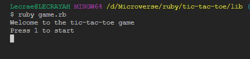
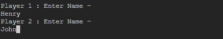
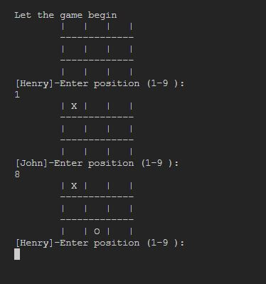
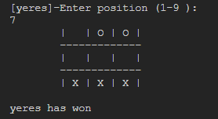
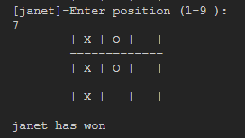

# tic-tac-toe

In this project, we build a Tic Tac Toe game. The main goal is to put into practice the main concepts of Object Oriented Programming. Particularly, classes and access to their attributes.

## Built With

- Ruby

## Game Instructioons

1. Run this command main.rb or bin/main.rb on your project folder
2. Press 1 to start the game

   

3. Enter the player details of first and second player

   

4. An empty board will be shown indicating the start of the game. The board has 9 positions so each player will be choosing a position where to play
5. The player number 1 will be requested to enter a position between 1-9 only.

   

6.The players are required to play by the tic tac game rules thus they are enforced in the game .

- No playing in a position that has already been played.

7. There are several winning combinations

## 🤝 Contributing

You are welcome to make contributions to the repository. Contributions may be made through issues comments and feature requests.

## 👤 Author

# Hillary Okerio

- GitHub [@hillarioh](https://github.com/hillarioh/)
- Twitter: [@hillaokri](https://twitter.com/hillaokri)
- LinkedIn: [Hillary](https://www.linkedin.com/in/hillaryokerio/)

# Calvin

- GitHub [@calvinoea](https://github.com/calvinoea/)
- Twitter: [@yasukeoz](https://twitter.com/yasukeoz)
- LinkedIn: [Calvin](https://www.linkedin.com/in/calvin-ebun-amu-9b200017a/)

## Show your support

Give a ⭐️ if you like this project!

## 📝 License

This project is MiT licensed.
